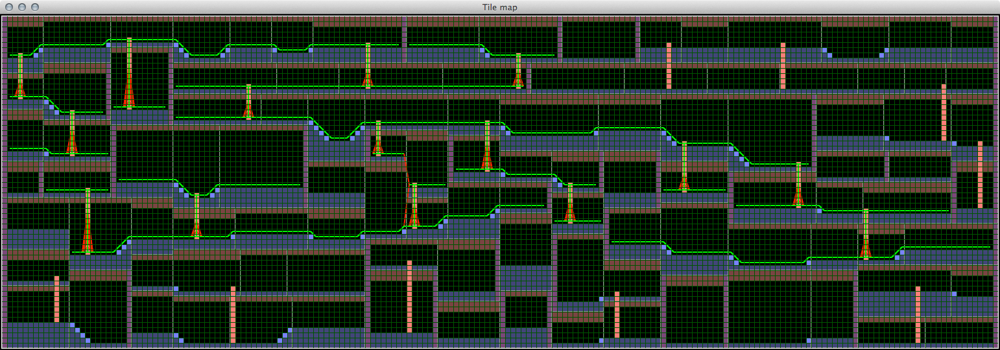

Procedural 2D platform game map generator, created for #procjam 2014.

Requires Python 2.6+.

Run `python gen_tilemap.py` to generate a map.

This project is free software, under the terms of the MIT license
as set out in `LICENSE`.
